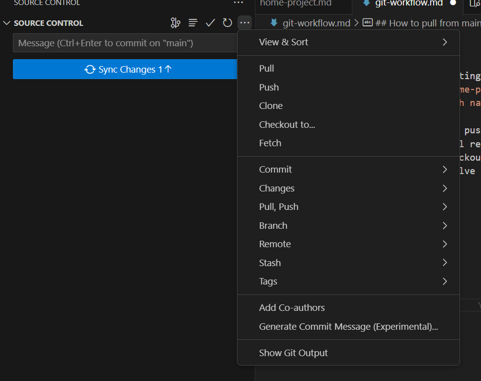

0. Checkout main
1. Sync with main (pull)
2. Create a new branch, starting with your name and a / - `omer/class-014-home-project`
   - `git checkout -b <branch name>`
   - Or use vscode ui
3. Work normally, commit and push
4. When finished, open a pull request
5. In case of conflicts, checkout main, pull and merge to your branch to resolve conflicts

## How to pull from main

1. Checkout main
2. Sync main (pull)
3. Checkout your branch
4. Merge main:
   - `git merge main`
   - from the vscode UI:
     
     Branch > merge branch
