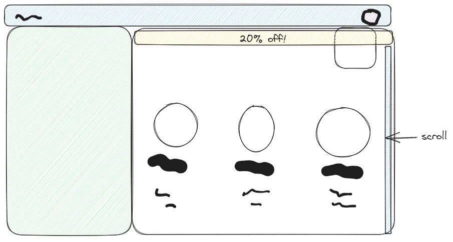
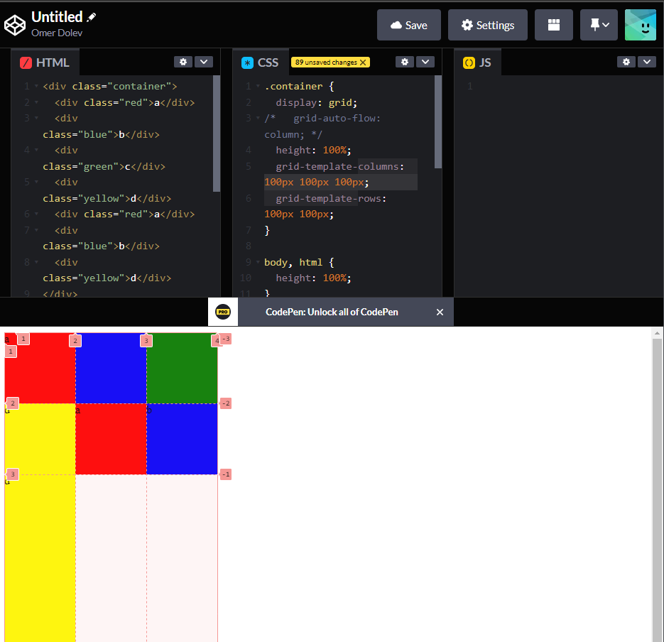
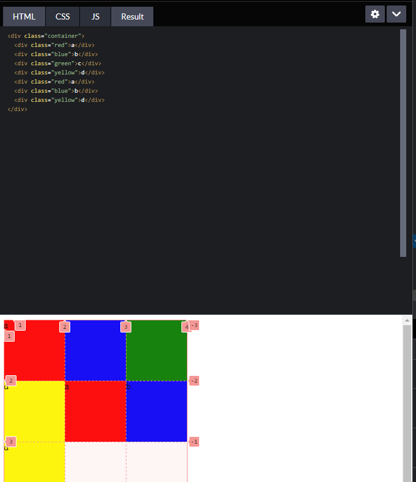

Choose one of the following (increasing difficulty level):
* add "promotion banner" to the class site. benner should span only the main part and the scoll should be only on the main:

* create "code pen" style layout: 3 columns on top of the main, scroll in the main:

* code pen extra challange: collapse/stack the columns when screen is too narrow:
