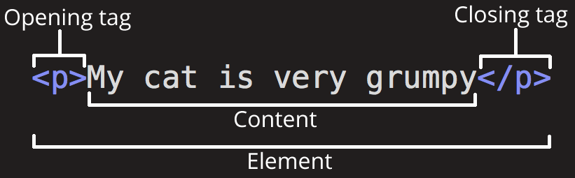
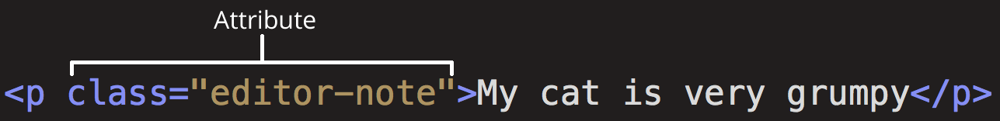

# HTML

* HTML Tags
  * Attributes
  * Void Elements
* HTML Structure
*

## HTML tags 

The main parts of an HTML tag are:
* Opening tag
* Closing tag
* Content
* Element



### Attributes 

Attributes contain extra information about the element.
Attribute must have:

* Space between it and the element name or previous attriutes 
* Attribute name followed by an equal sign
* The attribute value wrapped by quotation marks.



### Void Elements

Some elements have no content and are called "Void Elements", for example the `img` tag:
```html

```
<br>
<br>
<br>

## HTML Document Structure

Let's look at the following HTML document:

```html
<!doctype html>
<html lang="en-US">

  <head>
    <meta charset="utf-8" />
    <meta name="viewport" content="width=device-width" />
    <title>My test page</title>
  </head>

  <body>

  </body>

</html>
```

### `<!DOCTYPE html>`
The document type.
 In the mists of time, when HTML was young (around 1991/92), doctypes were meant to act as links to a set of rules that the HTML page had to follow to be considered good HTML, which could mean automatic error checking and other useful things. 
 but no browser ever used the DOCTYPE for anything other than switching between render modes.

The only purpose of <!DOCTYPE html> nowdays is to activate
[no-quirks](https://developer.mozilla.org/en-US/docs/Web/HTML/Quirks_Mode_and_Standards_Mode) render mode.

### `<html>`
the root element. 


### `<head>`
 includes things like keywords and a page description that you want to appear in search results, CSS to style our content, character set declarations, and more.

 ### `<meta charset="utf-8">`

 his element sets the character set your document should use to UTF-8 which includes most characters from the vast majority of written languages.

 ### `<meta name="viewport" content="width=device-width">`

This [viewport element](https://developer.mozilla.org/en-US/docs/Web/CSS/Viewport_concepts)
ensures the page renders at the width of viewport, preventing mobile browsers from rendering pages wider than the viewport and then shrinking them down.

### `<title>`
This sets the title of your page, which is the title that appears in the browser tab the page is loaded in. It is also used to describe the page when you bookmark/favorite it.

### `<body>`
This contains all the content that you want to show to web users when they visit your page, whether that's text, images, videos, games, playable audio tracks, or whatever else.

<br>
<br>
<br>

## Text Markup

### `<!-- comments -->`
Anything in HTML between <!-- and --> is an HTML comment. The browser ignores comments as it renders the code.

### `Headings`

Heading elements allow you to specify that certain parts of your content are headings — or subheadings.

```html
<!-- 6 heading levels: -->
<h1>My main title</h1>
<h2>My top level heading</h2>
<h3>My subheading</h3>
<h4>My sub-subheading</h4>
<h5>My sub-subheading</h5>
<h6>My sub-subheading</h6>
```
 >**`NOTE:`** Don't use heading elements to make text bigger or bold, because they are used for accessibility and other reasons such as SEO. Try to create a meaningful sequence of headings on your pages, without skipping levels.


<br>
<br>
<br>

# TODO