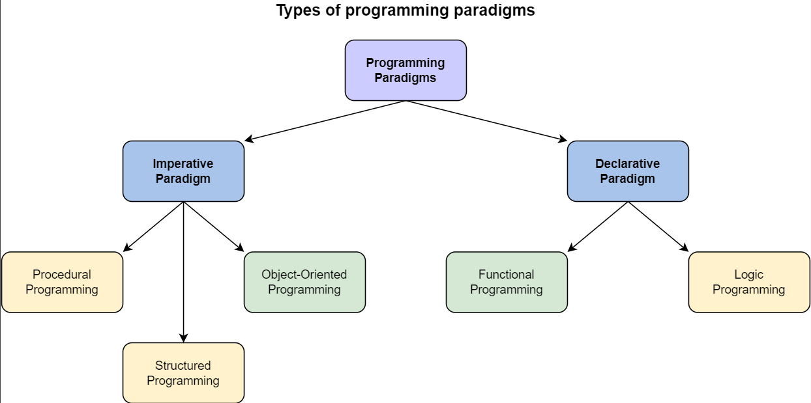

# `Programming Paradigms`

Programming paradigms are a way to classify programming lanuages based on their features. It's used to explain how those languages approach to solving problems.



## `Imperative Programming`
In imperative programming, we're focusing on what steps are needed to be completed to solve a problem.

code describes to the machine a step-by-step process of how to execute the program.

The step-by-step process contains individual statements, instructions or function calls. This process is called the `Control Flow`.

In imperative programming, the programmer is explicitly explaining the computer what to do and how to do it to achieve a certain solution to a problem.

The progammer focuses on `HOW` to solve the problem.

```python
# Calculate total in the list
total = 0 
myList = [1,2,3,4,5]

# Create a for loop to add numbers in the list to the total
for x in myList:
     total += x
print(total)
```

Example of imperative programming languages: 
* C
* Java
* Python

## `Declarative Programming`

In declarative programming, we're focusing on defining the problem, and let the machine decide how to solve it.

The code describes to the machine the result the program needs to achieve, and it decides the control flow needed to execute the program.

The programmer focuses on `WHAT` result solves the problem. 

```python
mylist = [1,2,3,4,5]

# set total to the sum of numbers in mylist
total = sum(mylist)
print(total) 
```

Example for declarative programming languages: 
* SQL 
* Prolog
* HTML, CSS (and many other markup languages)


