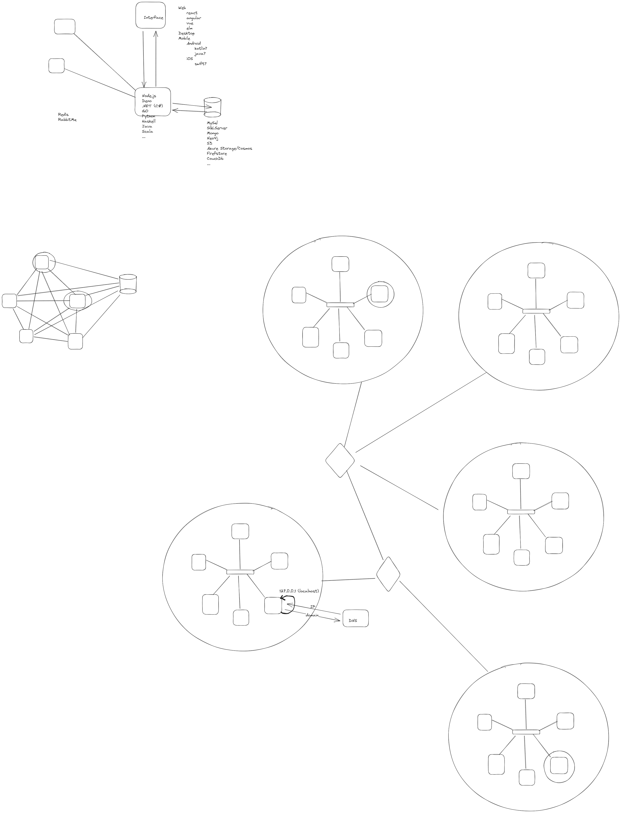

# Agenda
* Intro
* What does fullstack even mean?
* What is coding?
* Client server and the web
* Our stack
* HTML

# what is needed from a developer?
* idea to reality
* problem solving
* breakdown and analysis skills
* communication skills
* teamwork
* google-fu
* self learning

# What is FULL-STACK??
* Stack - מחסנית
* Tech stack - collection of tech used to build an app
* developing client and server

# Code vs Software
* code is textual
* software is binary
* code == compiler ==> software
* interpretation vs compilation
    * compilation is faster
    * interpretation is easier to distribute

# programming languages and code
* low level - closer to machine code
* high level - closer to "natural language"

# internet
* platform
* web
* satelite
* radio
* website
* server
* files
* messenger

youtube.com --> 10.250.0.1 --> XXXXXX  
(domain)    -->    (IP)    --> (MAC address)|

localhost  
127.0.0.1

# client server
* server is offering services
* server is the "brain" of the system
* clients offer access to server functions
    * GUI - graphical user interface (browser)
    * API - application programming interface
    * CLI - command line interface

# why web development?
* no download
* available to everyone with a browser
* easier to network
* updates and distribution