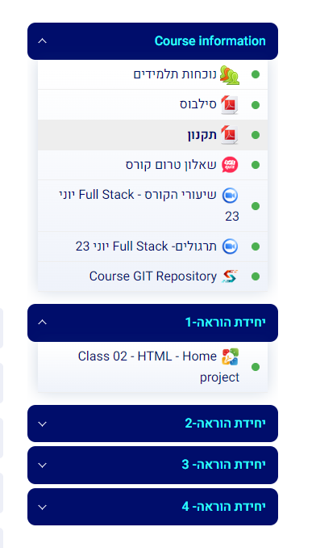

# Choose your own advanture!
Choose to implement one of the following tasks:
* Improve your personal site from the previous project
    * Extract styles to external stylesheet
    * Use classes and share common styles between elements and pages
* Implement a "medium" or blog like page. [See example here](https://crampeteb.medium.com/beginners-guide-to-full-stack-web-development-347528b696e0)
* Implement a list of lists accordion component like in the course site:
